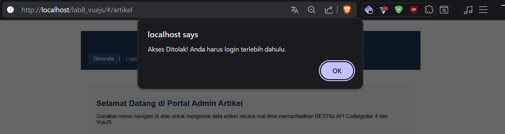
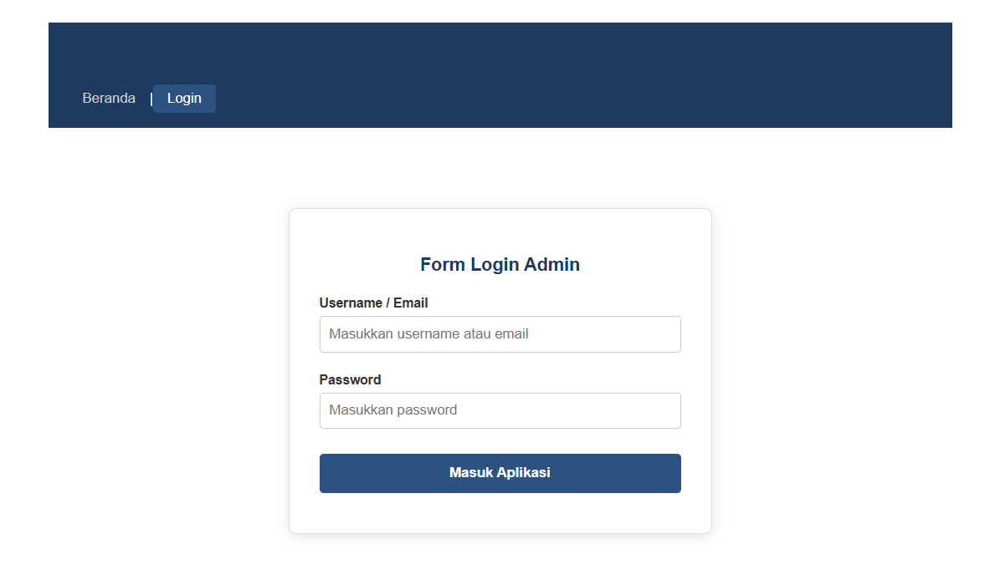
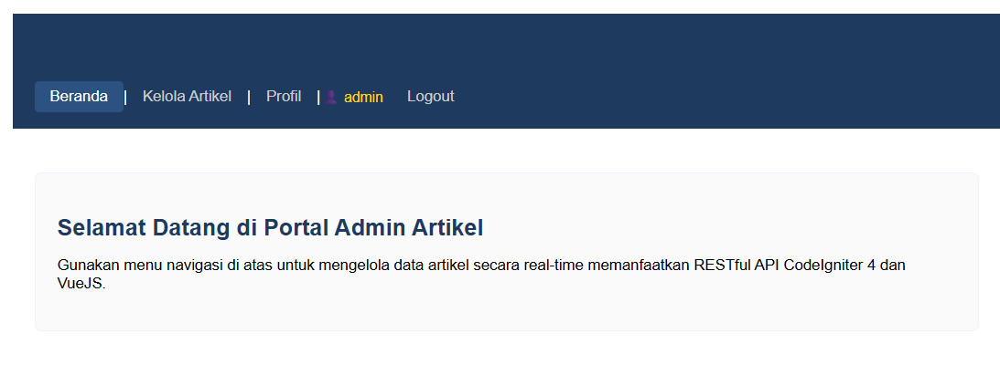
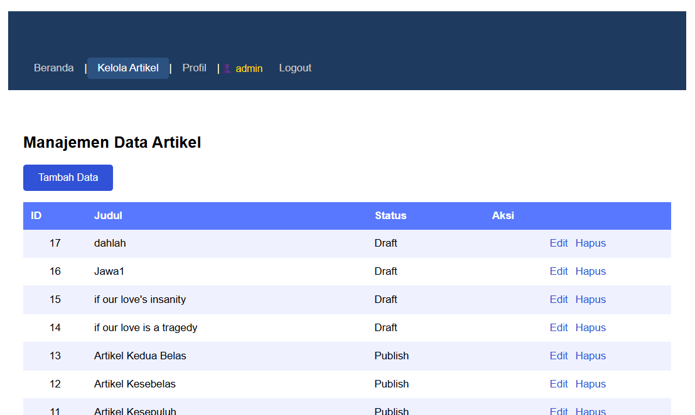
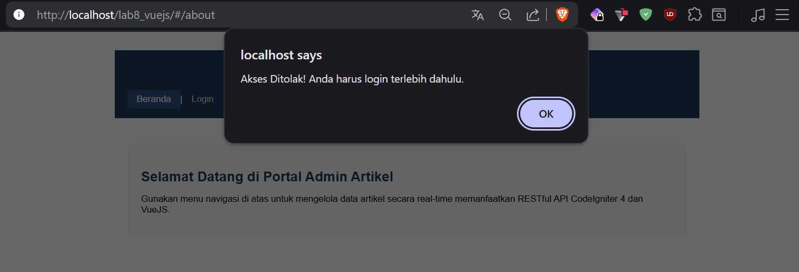

# Laporan Praktikum 13: VueJS Autentikasi dan Navigation Guards (SPA Security)

Repository ini dibuat untuk memenuhi tugas mata kuliah Pemrograman Web 2. Praktikum ini berfokus pada implementasi sistem keamanan dan pembatasan hak akses rute pada sisi klien (*Client-Side Security*) menggunakan **Navigation Guards (`beforeEach`)** pada Vue Router, serta proses autentikasi login yang terintegrasi dengan backend API CodeIgniter 4 menggunakan **Axios**.

## Tujuan Praktikum
1. Mahasiswa mampu memahami konsep keamanan dan pembatasan hak akses rute pada sisi klien (*Client-Side Security*).
2. Mahasiswa mampu memahami konsep Navigation Guards (`beforeEach`) pada Vue Router.
3. Mahasiswa mampu membuat API Endpoint autentikasi pada backend CodeIgniter 4.
4. Mahasiswa mampu mengimplementasikan modul Login dan proteksi halaman admin pada aplikasi *Single Page Application* (SPA) Frontend API.

---

## Analisis Ringkas Alur Kerja Fungsional

### 1. `router.beforeEach()` (Vue Router Navigation Guards)
Pada arsitektur *Single Page Application* (SPA), seluruh komponen UI sudah dimuat di awal oleh browser klien. Oleh karena itu, kita memerlukan pengaman di sisi kode JavaScript agar pengguna yang belum login tidak bisa melompat ke halaman rahasia secara ilegal.

Fungsi `router.beforeEach((to, from, next) => { ... })` bertindak sebagai pos pemeriksaan atau "satpam" yang mencegat setiap perpindahan rute sebelum komponen baru sempat dirender. 
* Fungsi ini memeriksa apakah rute yang dituju (`to`) memiliki properti pengaman `meta: { requiresAuth: true }`.
* Sistem kemudian memeriksa status login di penyimpanan lokal (`localStorage.getItem('isLoggedIn')`).
* Jika rute membutuhkan autentikasi dan pengguna belum terautentikasi, rute akan dibatalkan, dan pengguna dilempar secara paksa ke halaman `/login`.

### 2. Axios HTTP Post (Proses Autentikasi)
Ketika pengguna mengisi formulir login dan menekan tombol submit, fungsi `prosesLogin()` akan memicu pustaka **Axios** untuk mengirimkan HTTP Request dengan method **POST** menuju endpoint API Backend (`http://localhost:8080/auth/login`) sembari membawa data kredensial (`username` dan `password`).
* **Skenario Sukses**: Backend memvalidasi data tersebut terhadap database. Jika cocok, backend mengirimkan respon sukses. Axios menangkap respon ini, menyimpan status login ke dalam `localStorage`, memperbarui status reaktif aplikasi, lalu mengalihkan halaman ke menu manajemen artikel.
* **Skenario Gagal**: Jika data tidak valid, backend mengirimkan status eror (misal 401 Unauthorized), Axios menangkap kegagalan tersebut, dan memunculkan notifikasi peringatan kepada pengguna tanpa merusak state aplikasi.

---

## Langkah-Langkah Praktikum & Penjelasan Kode

### 1. Pengembangan Backend API Autentikasi (CodeIgniter 4)
Kita membuat Controller baru di sisi backend bernama `Auth.php` yang memuat logika pencocokan *username* dan *password* dari request klien dengan data yang ada di database user. Di sisi `app/Config/Routes.php`, kita menambahkan rute khusus:
```php
$routes->post('auth/login', 'Auth::login');
```
2. Pembuatan Komponen Login (components/Login.js)
Komponen modular yang bertugas menampilkan form input login serta mengeksekusi pengiriman data kredensial ke server backend via Axios.

```JavaScript
export default {
    template: `
        <div class="login-container">
            <h2>Form Login Pengguna</h2>
            <form @submit.prevent="handleLogin">
                <div class="form-group">
                    <label>Username</label>
                    <input type="text" v-model="username" required placeholder="Masukkan username">
                </div>
                <div class="form-group">
                    <label>Password</label>
                    <input type="password" v-model="password" required placeholder="Masukkan password">
                </div>
                <button type="submit" class="btn btn-primary">Masuk Sistem</button>
            </form>
        </div>
    `,
    data() {
        return {
            username: '',
            password: ''
        }
    },
    methods: {
        handleLogin() {
            // Melakukan HTTP POST request menggunakan Axios ke backend API
            axios.post('http://localhost:8080/auth/login', {
                username: this.username,
                password: this.password
            })
            .then(response => {
                if (response.data.success) {
                    localStorage.setItem('isLoggedIn', 'true');
                    this.$root.isLoggedIn = true;
                    alert('Login Berhasil!');
                    this.$router.push('/artikel'); // Alihkan rute ke halaman artikel
                } else {
                    alert('Kredensial salah, silakan coba lagi.');
                }
            })
            .catch(error => {
                alert('Proses login gagal: ' + error.message);
            });
        }
    }
};
```
3. Modifikasi Tugas: Proteksi Rute dan Komponen About.js (index.html)
Sesuai dengan instruksi tugas praktikum, rute halaman profil mahasiswa (/about) ikut diamankan menggunakan properti meta: { requiresAuth: true } bersama dengan rute /artikel.

Berikut adalah implementasi skrip konfigurasi rute dan filter beforeEach pada file index.html:
```html
<script src="[https://unpkg.com/vue@3/dist/vue.global.js](https://unpkg.com/vue@3/dist/vue.global.js)"></script>
<script src="[https://unpkg.com/vue-router@4/dist/vue-router.global.js](https://unpkg.com/vue-router@4/dist/vue-router.global.js)"></script>
<script src="[https://unpkg.com/axios/dist/axios.min.js](https://unpkg.com/axios/dist/axios.min.js)"></script>

<script type="module">
    import Home from './components/Home.js';
    import Artikel from './components/Artikel.js';
    import About from './components/About.js';
    import Login from './components/Login.js';

    // 1. Definisi Rute Aplikasi dan Proteksi Meta Auth
    const routes = [
        { path: '/', component: Home },
        { path: '/login', component: Login },
        { 
            path: '/artikel', 
            component: Artikel, 
            meta: { requiresAuth: true } // Terproteksi Login
        },
        { 
            path: '/about', 
            component: About, 
            meta: { requiresAuth: true } // Tugas Modifikasi: Ikut Terproteksi Login
        }
    ];

    const router = VueRouter.createRouter({
        history: VueRouter.createWebHashHistory(),
        routes
    });

    // 2. Implementasi Global Navigation Guards
    router.beforeEach((to, from, next) => {
        const isAuthenticated = localStorage.getItem('isLoggedIn') === 'true';
        
        // Cek apakah rute tujuan membutuhkan status login
        if (to.matched.some(record => record.meta.requiresAuth)) {
            if (!isAuthenticated) {
                alert('Akses Ditolak! Anda harus login terlebih dahulu.');
                next('/login'); // Lempar paksa ke rute login
            } else {
                next(); // Izinkan masuk rute
            }
        } else {
            next(); // Bebas akses rute umum
        }
    });

    const app = Vue.createApp({
        data() {
            return {
                isLoggedIn: localStorage.getItem('isLoggedIn') === 'true'
            }
        },
        methods: {
            handleLogout() {
                localStorage.removeItem('isLoggedIn');
                this.isLoggedIn = false;
                alert('Anda berhasil logout.');
                this.$router.push('/login');
            }
        }
    });
    
    app.use(router);
    app.mount('#app');
</script>
```

Hasil Uji Coba Aplikasi (Screenshots)
1. Skenario A: Penolakan Rute Otomatis (Gagal Akses Sebelum Login)
Berikut adalah screenshot bukti sistem melakukan penolakan rute saat pengguna mencoba mengakses URL /artikel atau /about secara langsung sebelum melakukan autentikasi login.



2. Skenario B: Pengisian Formulir Login & Validasi Kredensial
Tampilan komponen formulir login pengguna ketika diakses. Pengguna memasukkan data username dan password yang terdaftar pada database.





3. Halaman About Terproteksi



